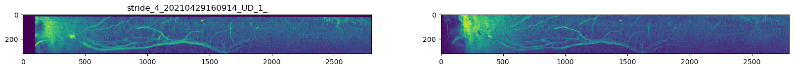

# Labelling tools for IR data & SWIR data alignment 

[](https://python.org)
[](https://pypi.org/project/PyQt5/)
[](https://opencv.org)
[](LICENSE)

**Custom annotation tools for hyperspectral root-soil analysis** | VISNIR (400–1700 nm) · SWIR | Plant & Soil 2025

### Repository Description:

This repository contains two labeling tools developed for annotating visual and near-infrared (VISNIR) as well as short-wave infrared (SWIR) data. Additionally, the repository contains a Jupyter notebook with the code for SWIR data alignment used to ensure consistency of the masks for both the March (living) and April (dead) datasets. These tools were created for the purpose of spectral clustering analysis belowground, specifically focusing on discriminating root-soil interfaces, grass-herb roots, and living-dead roots within the VISNIR and SWIR regions. Those analyses required a previous labelling, which was done by these tools.



### Repository contents:

| File/Folder | Description |
|-------------|-------------|
| `VISNIR_labeling_tool/` | PyQt5 tool for annotating VISNIR (400–1700 nm) data |
| `SWIR_labeling_tool/` | PyQt5 tool for annotating SWIR data |
| `SWIR_alignment.ipynb` | Jupyter notebook — aligns masks across March/April datasets (1034–1035 nm band) |

### Usage:

Researchers can utilize these labelling tools to streamline the process of annotating spectral data, thereby enhancing the efficiency and accuracy of analyses conducted in the context of below-ground spectral clustering.


### Citation

```bibtex
@misc{Baykalov2024scripts,
  Author = {Pavel Baykalov},
  Title = {Labelling tools for IR data & SWIR data alignment},
  Year = {2024},
  Publisher = {GitHub},
  Journal = {GitHub repository},
  Howpublished = {\url{https://github.com/dIcarusb/Labelling-tools-for-IR-data/tree/main}}
}
```
